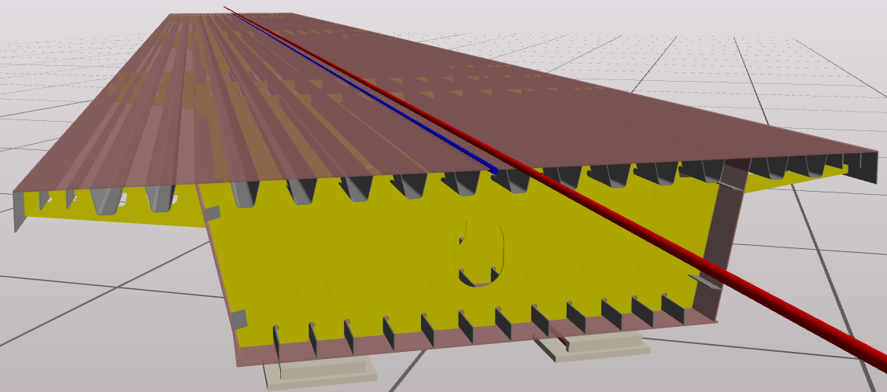

# ifc2mct

## Overview

The project **ifc2mct** is part of my Master's thesis, where an IFC4x1-based method to describe alignment-based steel plate-girder (box-grder) bridge and its mapping to MCT (midas command text) are both presented. To follow the dissertation, this project is also divided into two parts, one is to provide interfaces to produce the bridge's data in the form of .ifc, the other is to translate the built data to mct file which can be imported to **Midas Civil**.

## Introduction

### Part 1

This sub-project, which is called **ifc2mct.BridgeFactory**, aims to provide a uniform interface (**BridgeBuilder**) to **Application layer** so that any application in this layer is able to produce IFC data of a continus steel-box-girder bridge. The infrastructure of this project is [XbimEssentials](https://github.com/xBimTeam/XbimEssentials) library, which provides basic functions to access and produce IFC data. **AlignmentBuilder** is a built-in class to create an instance of entity IfcAlignment that has a simple alignment curve. This module is not necessary when **Application layer** or other sources can provide alignment information, for example, IFC files exported from Civil3D. **IfcModelBuilder** is an encapsulation of some interfaces of XbimEssentials in order to quickly construct IFC entity from basic geometric data structure (point, line, matrix, etc). The overall architecture is shown below:

The table below illustrates the interfaces provided by **ifc2mct.BridgeFactory**.

Name | Arguments | Function
---- | --------- | -------- 
Constructor | path(String) | input ifc file
Build | - | build the IFC bridge model
Save | path(String) | save IFC model to appointed path
SetBridgeAlignment | startPosition(Double), endPosition(Double), offsetVertical(Double), offsetLateral(Double) | set an offset curve as bridge alignment which is derived from alignment curve 
SetOverallSection | dimensions(Double[5]) | set the section dimensions of a single-box-girder, which includes B1(the external top flange width), B2(the internal top flange width), B3(the external bottom flange width), B4(the internal bottom flange width), H(the height of box)
SetThickness | plateCode(Integer), distanceAlong(Double), thickness(Double) | define the thickness change of flanges and webs along the bridge alignment curve
AddStiffenerType | typeId(Integer), dimensions(Double[]) | define a type of stiffener profile, supported profiles are flat stiffener (H, B), T-shape stiffener (H, B, tw, tf) and U-shape stiffener (H, B1, B2, t, R)
AddStiffenerLayout | layoutId(Integer), <num(Integer), gap(Double)>[] | define a type of stiffener layout on the stiffened flanges and webs, the number of stiffeners and their gap between each other should be provided
AddStiffeners | plateCode(Integer), distanceAlong(Double), typeId(Integer), layoutId(Integer) | define the stiffener change by givien its type and layout at a particular position along the bridge alignment curve
AddBearingType | typeId(Integer), dx, dy, dz, rx, ry, rz(Boolean) | define a type of bearing by given constraint value for 3 axis
AddBearing | distanceAlong(Double), offsetLateral(Double), typeId(Integer) | add a specific bearing instance to a particular position along the bridge alignment

In the IFC4x1-based bridge representation presented, bridge alignment curve is an offset curve of the overall alignment curve as shown below:

**IfcBearing** is a newly added entity in IFC4x2 draft, so an instance of **IfcProxy** is used to replace it and a property set *Pset_BearingCommon* is assigned. Its positioning depends on the entity **IfcLinearPlacement**, in case most vendors haven't supported this IFC4x1 entity, the arribute *CartesianPosition* should be assigned for backward compatibility.

Flanges and webs are the most important components in a box-girder so they should better be represented by individual entities and then aggregated into an assembly which represents the girder. Some IFC4x2 features (say new *PredefinedType*) are adopted. **IfcSectionedSolidHorizontal** is selected to represent these linear element's shape along the alignment.

Stiffenrs (stiffening ribs) are part of their parent plates (flanges or webs), so they are aggregated into an instance of **IfcElementAssembly**. 

Currently, [XbimGeometry](https://github.com/xBimTeam/XbimGeometry) library hasn't adapted to IFC4x1. To enable the visualization, the source code is reviewed and updated to comput the geometry of **IfcAlignmentCurve**, **IfcSectionedSolidHorizontal** and **IfcLinearPlacement**. For now, it's not a good implementation and can only work in a particular situation when the horizontal alignment curve contains only one line segment or arc segment.

### Part 2

To be continued..

## Getting Started

## Acknowledgements